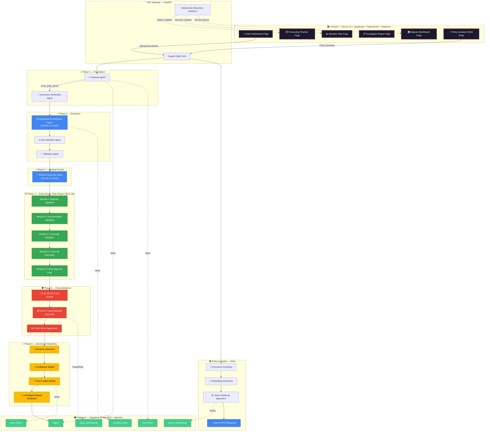
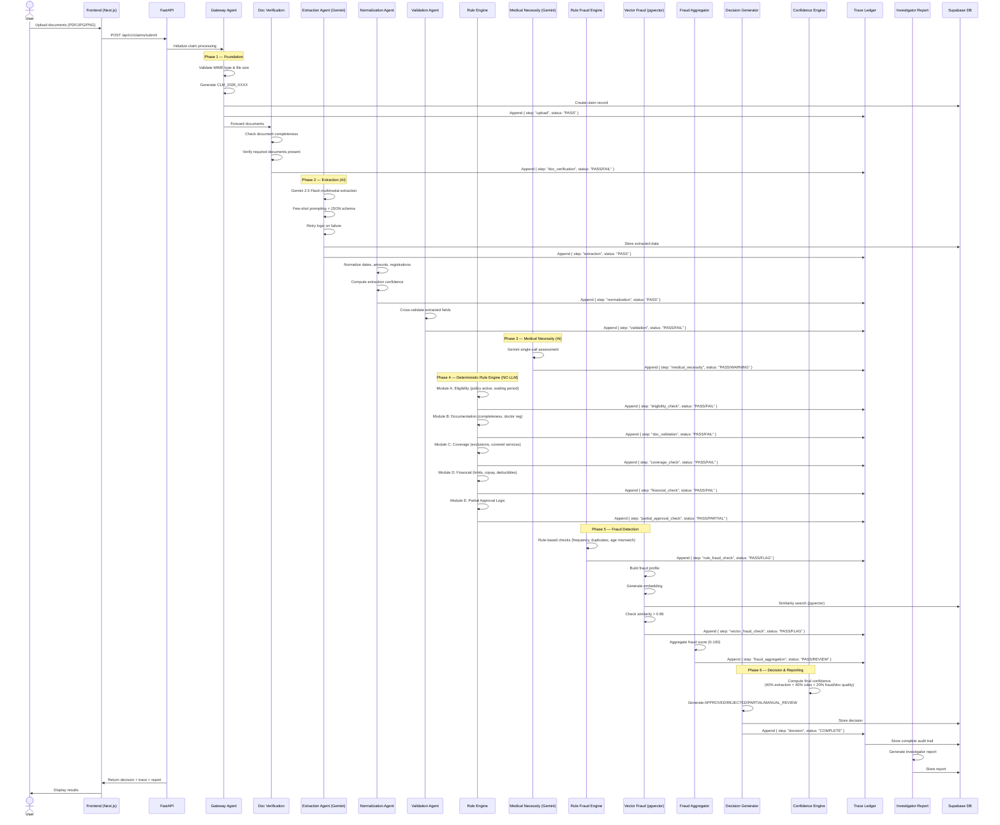
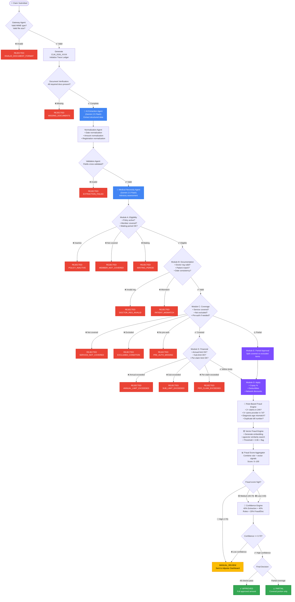
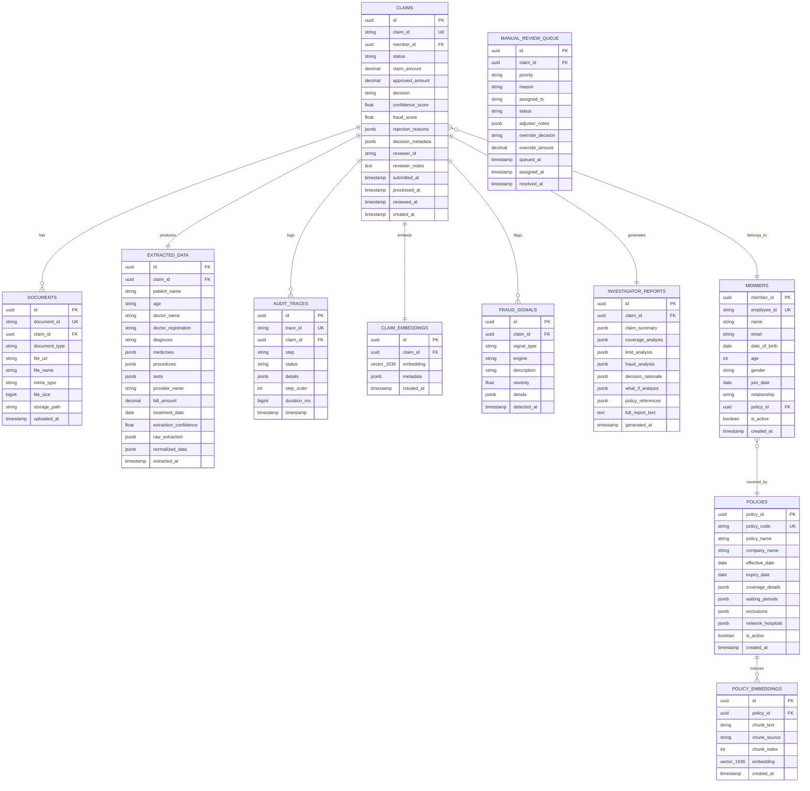

# 🏥 Plum OPD Claim Adjudication System

> **AI-Augmented, Deterministic-Decided** — A production-grade multi-agent pipeline for automated OPD insurance claim adjudication.

### 🌐 Live Deployments
* **Frontend Application (Vercel)**: [https://plum-opd-system.vercel.app](https://plum-opd-system.vercel.app)
* **Backend API Gateway (Render)**: [https://plum-opd-system.onrender.com/api/v1](https://plum-opd-system.onrender.com/api/v1)
* **Interactive API Docs (Render Swagger)**: [https://plum-opd-system.onrender.com/docs](https://plum-opd-system.onrender.com/docs)

[](https://nextjs.org/)
[](https://fastapi.tiangolo.com/)
[](https://supabase.com/)
[](https://ai.google.dev/)
[](https://www.typescriptlang.org/)
[](https://python.org/)
[](LICENSE)

---

## 📋 Table of Contents

- [Overview](#overview)
- [Core Philosophy](#core-philosophy)
- [Architecture](#architecture)
- [Pipeline Stages](#pipeline-stages)
- [Decision Flow](#decision-flow)
- [ER Diagram](#er-diagram)
- [Tech Stack](#tech-stack)
- [Project Structure](#project-structure)
- [Getting Started](#getting-started)
- [Environment Variables](#environment-variables)
- [API Documentation](#api-documentation)
- [Testing](#testing)
- [Deployment](#deployment)
- [Assumptions](#assumptions)
- [Contributing](#contributing)

---

## Overview

The **Plum OPD Claim Adjudication System** is an AI-augmented, deterministic-decided platform for processing Outpatient Department (OPD) insurance claims. It combines multi-agent AI extraction with a strict deterministic rule engine to deliver transparent, auditable, and policy-compliant claim decisions.

### What It Does

1. **Accepts** medical documents (PDFs, images) via a clean submission UI
2. **Extracts** structured data using Gemini 2.5 Flash multimodal AI
3. **Validates** against policy terms using a deterministic rule engine
4. **Detects fraud** via rule-based and vector-similarity engines
5. **Generates decisions** with full audit trails and investigator reports
6. **Provides** a Policy Assistant (RAG) for natural language policy queries
7. **Queues** uncertain claims for human adjuster review

---

## Core Philosophy

> **"AI Reads. Rules Decide."**

This system enforces a strict responsibility boundary between AI and deterministic logic:

| Capability | AI Agents ✅ | Deterministic Engine ✅ |
|---|---|---|
| Read documents | ✅ | ❌ |
| Extract information | ✅ | ❌ |
| Assess medical necessity | ✅ | ❌ |
| Detect suspicious patterns | ✅ | ❌ |
| Generate explanations | ✅ | ❌ |
| Answer policy questions (RAG) | ✅ | ❌ |
| **Approve claims** | ❌ NEVER | ✅ |
| **Reject claims** | ❌ NEVER | ✅ |
| **Calculate payouts** | ❌ NEVER | ✅ |
| **Override policy rules** | ❌ NEVER | ✅ |
| **Determine financial decisions** | ❌ NEVER | ✅ |

---

## Architecture

### System Architecture Diagram



---

## Pipeline Stages

### Detailed Processing Pipeline



---

## Decision Flow

### Claim Decision Flowchart



---

## ER Diagram

### Database Entity-Relationship Diagram



---

## Tech Stack

| Layer | Technology | Purpose |
|-------|-----------|---------|
| **Frontend** | Next.js 15 | React framework with App Router |
| **Language** | TypeScript | Type-safe frontend development |
| **Styling** | TailwindCSS | Utility-first CSS framework |
| **UI Components** | shadcn/ui | Accessible, composable components |
| **Backend** | FastAPI | High-performance Python API |
| **AI/LLM** | Gemini 2.5 Flash | Multimodal extraction & medical assessment |
| **Database** | PostgreSQL (Supabase) | Primary data store |
| **Vector Store** | pgvector | Embedding similarity search |
| **File Storage** | Supabase Storage | Document upload storage |
| **Auth** | Supabase Auth | Authentication (optional) |
| **Deployment (FE)** | Vercel | Frontend hosting |
| **Deployment (BE)** | Render | Backend API hosting |
| **Deployment (DB)** | Supabase | Managed PostgreSQL |
| **CI/CD** | GitHub Actions | Automated testing & deployment |
| **Containerization** | Docker / Docker Compose | Local development & deployment |

---

## Project Structure

```
plum-opd-system/
│
├── docs/                               # 📚 System architecture, assumptions, and design guides
├── database/                           # 🗃️ Database schema init, seed, and migrations SQL
│
├── backend/                            # 🐍 FastAPI Backend
│   ├── api/                            # REST route definitions (routes.py)
│   ├── app/                            # Multi-agent engines, deterministic rules, models, and services
│   ├── tests/                          # 84-case automated test suite
│   ├── main.py                         # Application entrypoint
│   └── requirements.txt                # Python dependencies
│
├── frontend/                           # ⚛️ Next.js 15 Frontend
│   ├── components/                     # React widgets (Timeline, Investigator Report)
│   ├── lib/                            # API fetch utility helper (api.ts)
│   └── src/app/                        # App Router Pages (Submission form, Decision Q&A, Adjuster Dashboard)
│
├── .github/workflows/                  # 🔄 CI/CD pipelines
└── reference/                          # 📎 Original assignment terms, rules, and test cases
```

## Getting Started

### Prerequisites

- **Node.js** >= 20.x
- **Python** >= 3.12
- **Docker** & **Docker Compose** (for local development)
- **Supabase** account (free tier)
- **Google AI** API key (Gemini 2.5 Flash)

### Local Development Setup

```bash
# 1. Clone the repository
git clone https://github.com/your-username/plum-opd-system.git
cd plum-opd-system

# 2. Copy environment variables
cp .env.example .env
# Edit .env with your actual keys

# 3. Start all services with Docker Compose
docker-compose up -d

# 4. Initialize the database
# (Supabase auto-runs init.sql, or manually:)
psql $DATABASE_URL -f database/init.sql
psql $DATABASE_URL -f database/seed.sql

# 5. Start the backend
cd backend
python -m venv venv
source venv/bin/activate  # or venv\Scripts\activate on Windows
pip install -r requirements.txt
uvicorn main:app --reload --port 8000

# 6. Start the frontend
cd frontend
npm install
npm run dev
```

### Quick Start with Docker

```bash
docker-compose up --build
# Frontend: http://localhost:3000
# Backend:  http://localhost:8000
# API Docs: http://localhost:8000/docs
```

---

## Environment Variables

| Variable | Description | Required |
|----------|------------|----------|
| `SUPABASE_URL` | Supabase project URL | ✅ |
| `SUPABASE_ANON_KEY` | Supabase anonymous key | ✅ |
| `SUPABASE_SERVICE_KEY` | Supabase service role key | ✅ |
| `DATABASE_URL` | PostgreSQL connection string | ✅ |
| `GEMINI_API_KEY` | Gemini API key (Google AI Studio) | ✅ |
| `GEMINI_MODEL` | Gemini model name (default: `gemini-3.1-flash-lite`) | ❌ |
| `NEXT_PUBLIC_API_URL` | Backend API URL | ✅ |
| `NEXT_PUBLIC_WS_URL` | WebSocket URL | ✅ |
| `CORS_ORIGINS` | Allowed CORS origins | ✅ |
| `LOG_LEVEL` | Logging level (INFO/DEBUG) | ❌ |
| `MAX_FILE_SIZE_MB` | Max upload file size (default: 10) | ❌ |
| `FRAUD_SIMILARITY_THRESHOLD` | Vector fraud threshold (default: 0.96) | ❌ |
| `CONFIDENCE_THRESHOLD` | Manual review threshold (default: 0.70) | ❌ |

---

## API Documentation

### Core Endpoints

| Method | Endpoint | Description |
|--------|---------|-------------|
| `POST` | `/api/v1/claims/submit` | Submit new claim with documents |
| `GET` | `/api/v1/claims/{claim_id}` | Get claim details |
| `GET` | `/api/v1/claims` | List all claims (paginated) |
| `GET` | `/api/v1/claims/{claim_id}/decision` | Get claim decision |
| `GET` | `/api/v1/claims/{claim_id}/trace` | Get audit trace ledger |
| `GET` | `/api/v1/claims/{claim_id}/report` | Get investigator report |
| `GET` | `/api/v1/claims/{claim_id}/fraud` | Get fraud signals |
| `POST` | `/api/v1/policy/ask` | Ask RAG policy question |
| `GET` | `/api/v1/review/queue` | Get manual review queue |
| `PUT` | `/api/v1/review/{claim_id}` | Submit review decision |
| `GET` | `/api/v1/health` | Health check |
| `WS` | `/ws/{claim_id}` | Real-time processing updates |

### Full OpenAPI Specification
* **Local Development**: `http://localhost:8000/docs`
* **Live Production Server**: [https://plum-opd-system.onrender.com/docs](https://plum-opd-system.onrender.com/docs)

---

## Testing

### Run All Tests

```bash
# Backend tests
cd backend
pytest tests/ -v --cov=app --cov-report=html

# Frontend tests
cd frontend
npm test

# Integration tests (TC001-TC010)
cd backend
pytest tests/test_cases_integration.py -v
```

### Test Cases

| ID | Name | Expected Decision |
|----|------|-------------------|
| TC001 | Simple Consultation | ✅ APPROVED (₹1,350) |
| TC002 | Dental Treatment (Mixed) | ⚠️ PARTIAL (₹8,000) |
| TC003 | Limit Exceeded | ❌ REJECTED (PER_CLAIM_EXCEEDED) |
| TC004 | Missing Documents | ❌ REJECTED (MISSING_DOCUMENTS) |
| TC005 | Pre-existing Condition | ❌ REJECTED (WAITING_PERIOD) |
| TC006 | Alternative Medicine | ✅ APPROVED (₹4,000) |
| TC007 | Pre-auth Required | ❌ REJECTED (PRE_AUTH_MISSING) |
| TC008 | Fraud Detection | 🔶 MANUAL_REVIEW |
| TC009 | Excluded Treatment | ❌ REJECTED (SERVICE_NOT_COVERED) |
| TC010 | Network Hospital | ✅ APPROVED (₹3,600 cashless) |

---

## Deployment

### Frontend → Vercel

1. Import your GitHub repository into [Vercel](https://vercel.com/).
2. Set the **Root Directory** to `frontend`.
3. Configure the environment variable:
   - `NEXT_PUBLIC_API_URL`: Your deployed Render backend URL (`https://<your-service>.onrender.com/api/v1`).
4. Click **Deploy**.

### Backend → Render

1. Create a new **Web Service** on [Render](https://render.com/).
2. Connect your GitHub repository.
3. Choose the **Docker** runtime.
4. Set up environment variables (`DATABASE_URL`, `GEMINI_API_KEY`, `JWT_SECRET`).
5. Click **Deploy Web Service**.

### Database → Supabase

1. Create a new Supabase project
2. Run `database/init.sql` in the SQL editor
3. Run `database/seed.sql` for initial data
4. Enable the `vector` extension

---

## Assumptions

1. **Policy Configuration**: Using the provided `policy_terms.json` as the single policy configuration
2. **Member Data**: Pre-seeded member records for test case employees (EMP001–EMP010)
3. **Doctor Registration**: Format validated as `[StateCode]/[Number]/[Year]` or `AYUR/[StateCode]/[Number]/[Year]`
4. **Copay Calculation**: 10% copay on consultation fees as defined in policy terms
5. **Network Discount**: 20% discount applied to consultation fees at network hospitals
6. **Per-claim Limit**: Strict ₹5,000 per-claim ceiling — claims exceeding this are REJECTED
7. **Sub-limit Enforcement**: Each coverage category (consultation, pharmacy, dental, etc.) has independent sub-limits
8. **Fraud Score Thresholds**: >70 = MANUAL_REVIEW, 40-70 = flagged but proceeds, <40 = clean
9. **Confidence Threshold**: Claims with confidence < 0.70 are sent to MANUAL_REVIEW
10. **Vector Similarity**: Threshold of 0.96 for POTENTIAL_DUPLICATE_PATTERN detection
11. **File Size Limit**: Maximum 10MB per uploaded document
12. **Supported Formats**: PDF, JPG, JPEG, PNG only
13. **Claim ID Format**: `CLM_YYYY_XXXX` where YYYY is current year, XXXX is zero-padded sequence
14. **Currency**: All amounts in Indian Rupees (₹ / INR)
15. **Timezone**: All timestamps in UTC, displayed in IST for the UI
16. **Pre-authorization**: MRI and CT Scan require pre-auth for claims above ₹10,000

---

## Contributing

1. Fork the repository
2. Create a feature branch (`git checkout -b feature/amazing-feature`)
3. Commit your changes (`git commit -m 'Add amazing feature'`)
4. Push to the branch (`git push origin feature/amazing-feature`)
5. Open a Pull Request

---

## License

This project is licensed under the MIT License — see the [LICENSE](LICENSE) file for details.

---

**Built with ❤️ for Plum Insurance**
