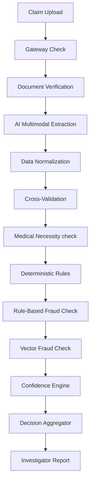

# High-Level Architecture Documentation

The **Plum OPD Claim Adjudication System** is an automated claim processing engine designed to evaluate outpatient department (OPD) insurance claims against policy rules. The system integrates advanced AI extraction and semantic fraud detection with a deterministic, rule-based policy validation layer.

---

## 1. Core Design Philosophy

- **AI as an Advisor, never the Adjudicator**: Artificial Intelligence (Large Language Models) reads unstructured medical documents, extracts data fields, checks semantic fraud similarity, and assesses medical necessity. However, AI *cannot* approve claims, reject claims, or calculate financial payouts.
- **Deterministic Financial & Policy Rules**: All rules governing limits, co-pays, hospital network discounts, and coverage exclusions are implemented in deterministic Python code. This avoids LLM hallucinations in critical financial decisions.
- **100% Auditability**: An immutable **Trace Ledger** logs every pipeline execution step sequentially. If a claim is rejected, the system records the exact rule code and the policy document section violated.

---

## 2. Pipeline Sequence

A claim undergoes 11 sequential processing steps:

1. **`gateway_check`**: Initial file validation (MIME-types, file sizes).
2. **`doc_verification`**: Confirms required files (e.g. invoice, medical prescription) are attached.
3. **`ai_extraction`**: Multimodal extraction using Gemini 2.5 Flash.
4. **`normalization`**: Standardizes fields (dates, amounts, doctor registration formats).
5. **`cross_validation`**: Validates data consistency (e.g., patient name matches member name).
6. **`medical_necessity_check`**: Advisory LLM check evaluating if the diagnosis warrants the treatment/medicines.
7. **`deterministic_rules_check`**: Core engine checking active coverage, exclusions, waiting periods, limits, and co-pays.
8. **`fraud_detection_check`**: Traditional rule check (multiple daily claims, duplicate invoices).
9. **`vector_fraud_check`**: Compares claims semantically against historical records using vector embeddings.
10. **`confidence_engine`**: Computes a weighted confidence score (40% Extraction, 40% Rules, 20% Fraud/Quality).
11. **`decision_aggregator`**: Commits the final decision (`APPROVED`, `REJECTED`, `PARTIAL`, or `MANUAL_REVIEW`).

---

## 3. Data Schema

The database models are designed to store claims, extracted fields, fraud indicators, audit traces, and the RAG document index.

### Claim Table
- `claim_id` (String, Primary Key)
- `member_id` (String, Foreign Key)
- `status` (Enum: `PENDING`, `DECIDED`, `REVIEWED`)
- `decision` (Enum: `APPROVED`, `REJECTED`, `PARTIAL`, `MANUAL_REVIEW`)
- `claim_amount` (Float)
- `approved_amount` (Float)
- `confidence_score` (Float)
- `fraud_score` (Float)
- `rejection_reasons` (JSON array)
- `notes` (String)
- `created_at` (Timestamp, UTC)

### Document Table
- `document_id` (UUID, Primary Key)
- `claim_id` (String, Foreign Key)
- `document_type` (String: invoice, prescription)
- `file_path` / `file_url` (String)

### Extracted Data Table
- `diagnosis` (String)
- `doctor_name` (String)
- `doctor_registration` (String)
- `medicines` (JSON array)
- `procedures` (JSON array)
- `tests` (JSON array)
- `provider_name` (String)
- `treatment_date` (Date)

### Audit Trace Table
- `trace_id` (UUID, Primary Key)
- `claim_id` (String, Foreign Key)
- `step` (String)
- `status` (Enum: `PASS`, `FAIL`, `WARNING`, `SKIP`, `ERROR`)
- `details` (JSON)
- `duration_ms` (Integer)
- `timestamp` (Timestamp, UTC)
