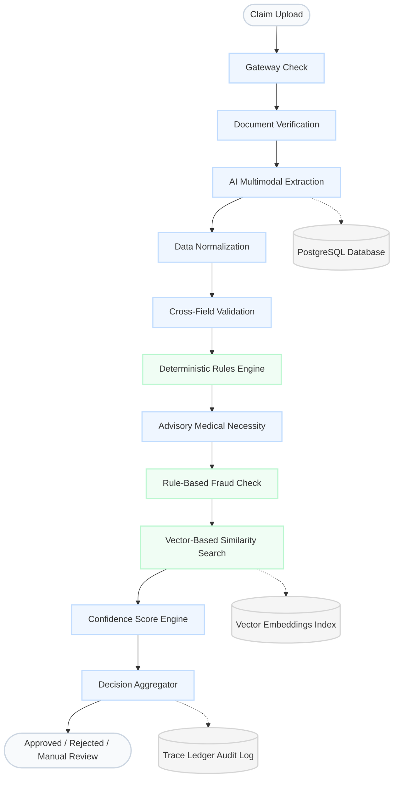

# Adjudication Pipeline Flow Diagram

This document contains a visual flowchart of the OPD claims adjudication data pipeline.

```mermaid
graph TD
    classDef startEnd fill:#f8fafc,stroke:#cbd5e1,stroke-width:2px;
    classDef agent fill:#eff6ff,stroke:#bfdbfe,stroke-width:2px;
    classDef rule fill:#f0fdf4,stroke:#bbf7d0,stroke-width:2px;
    classDef db fill:#f5f5f5,stroke:#d4d4d4,stroke-width:2px;

    Upload([Claim Upload]) --> Gateway[Gateway Check]
    Gateway --> Docs[Document Verification]
    Docs --> Extraction[AI Multimodal Extraction]
    Extraction --> Normalization[Data Normalization]
    Normalization --> Validation[Cross-Field Validation]
    Validation --> Rules[Deterministic Rules Engine]
    
    Rules --> Necessity[Advisory Medical Necessity]
    Necessity --> FraudRule[Rule-Based Fraud Check]
    FraudRule --> FraudVector[Vector-Based Similarity Search]
    
    FraudVector --> Confidence[Confidence Score Engine]
    Confidence --> Aggregator[Decision Aggregator]
    
    Aggregator --> Output([Approved / Rejected / Manual Review])

    %% Database interactions
    Extraction -.-> DB[(PostgreSQL Database)]
    FraudVector -.-> VectorStore[(Vector Embeddings Index)]
    Aggregator -.-> Trace[(Trace Ledger Audit Log)]

    class Upload,Output startEnd;
    class Gateway,Docs,Extraction,Normalization,Validation,Necessity,Confidence,Aggregator agent;
    class Rules,FraudRule,FraudVector rule;
    class DB,VectorStore,Trace db;
```
